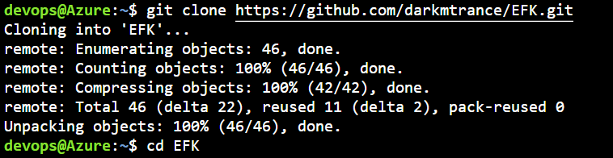
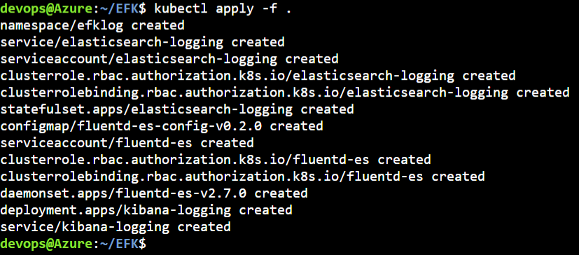
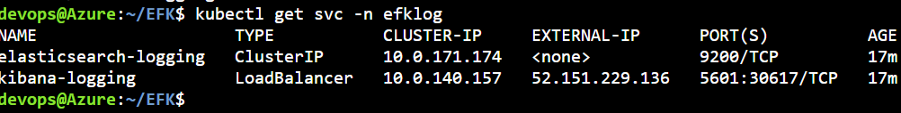
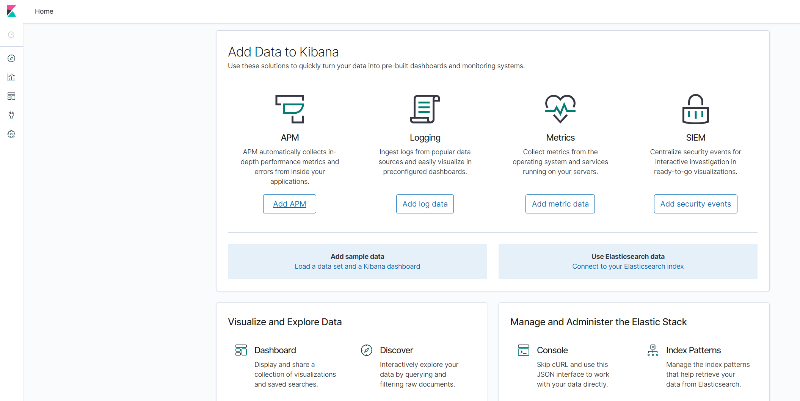
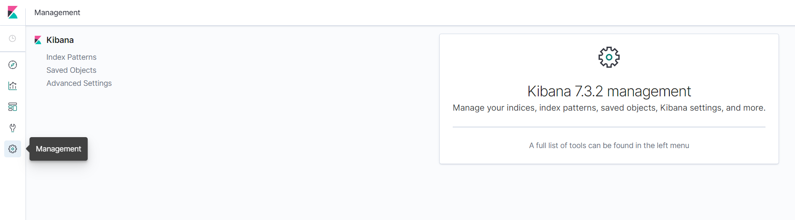
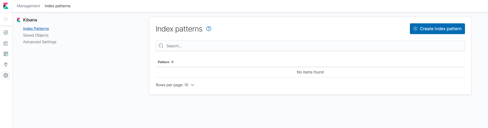
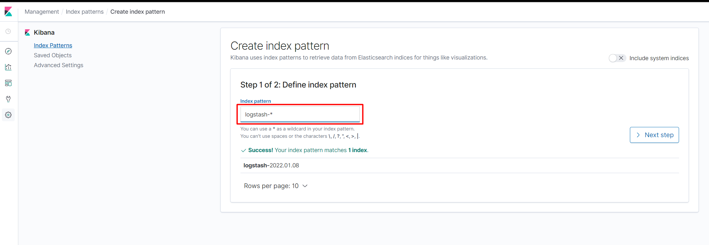
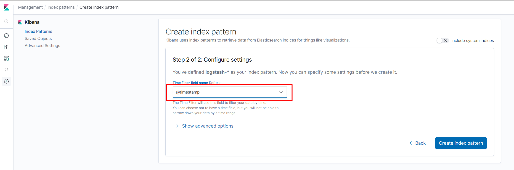
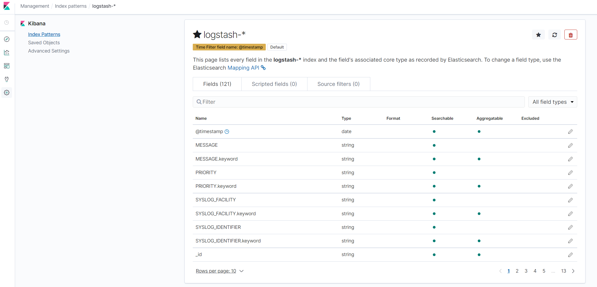
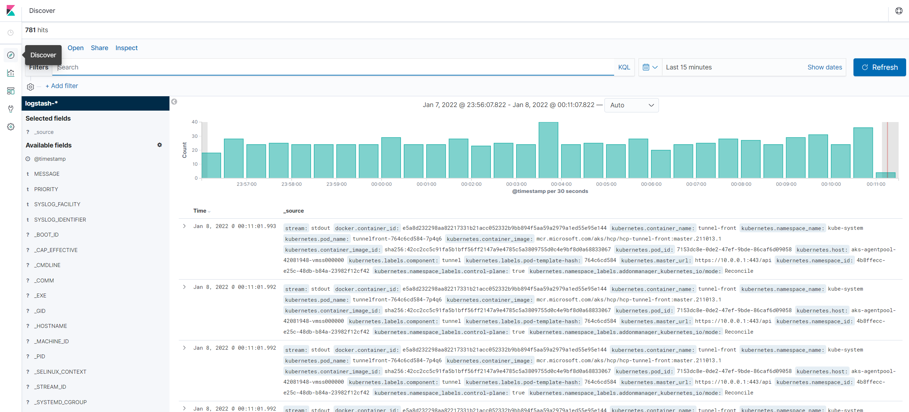

# EFK

>We’ll be using ElasticSearch (Storage), Fluentd (Logging Layer), and Kibana (Visualization) to store, aggregate & visualise logs.

## Requirements

- kubectl (check via kubectl version)
- a working kube-context with access to a Kubernetes cluster (check with kubectl get namespaces)

## Steps

reference: [EFK guide](https://medium.com/@chris_linguine/how-to-monitor-distributed-logs-in-kubernetes-with-the-efk-stack-1218a565ce0c)

- get file EFK

```
git clone https://github.com/darkmtrance/EFK.git
cd EFK
```



- install EFK

```
kubectl apply -f .
```



- access to kibana 

```
kubectl get svc -n efklog
```



- open the service kibana-logging http://52.151.229.136:5601 in your browser



>You now have Kibana

- Once it has loaded, click on the management icon, and go to index patterns



- Click Create index pattern



- Enter ```logstash-*``` in the field for the index pattern



- Click Next step & Select @ timestamp & Create index pattern



- You should now have a valid index pattern



- You should now be able to see all your logs in Kibana. On the Kibana dashboard, go to the Discover page.


